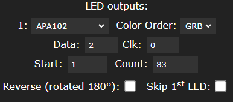

# klipper-leds
This script syncrhonizes a led strip with klipper/moonraker.
The information are shown with colors and animations.

4 area are defined:
- temperature of the hotend
- temperature of the bed
- status of the filament sensor
- status of the printer

## 1. installation

Install python libraries on the raspbery pi :
```
sudo apt install python3-venv python3-pip
pip3 install websocket-client pyserial
```

## 2. script installation
copy the script in ~/scripts directory

## 3. service
Definition of the service:

```
[Unit]
Description=Starts Klipper Leds on startup
After=network.target
[Install]
WantedBy=multi-user.target
[Service]
Type=simple
User=pi
RemainAfterExit=yes
ExecStart=/usr/bin/python3 /home/pi/scripts/klipper-leds.py
Restart=always
RestartSec=10
```

## 4. configuration

## 5. wled installation on the microcontroller
WARNING: install at least the 0.13 version of wled for a good stability of the serial link:
https://github.com/Aircoookie/WLED/releases

WLED configuration for an ESP32 and SPI ledstrip (APA102c):
